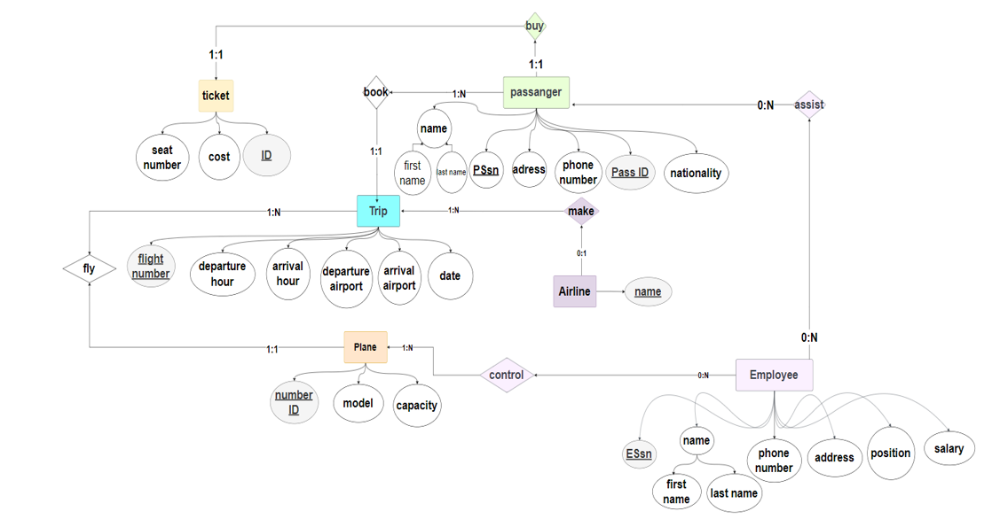
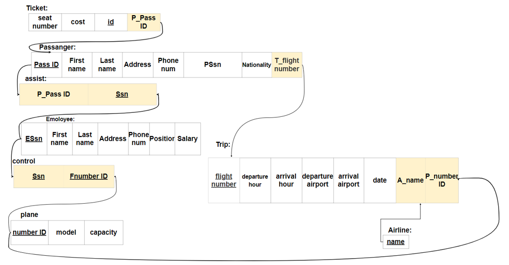

# Airport-Management-System-Database
**The Airport Database is designed to manage information related to airlines, planes, trips, passengers, tickets, employees, assistance, and control within an airport system**
# Database:
**Relational Database By MySQL**
# ER Diagram:

# Schema Diagram:

